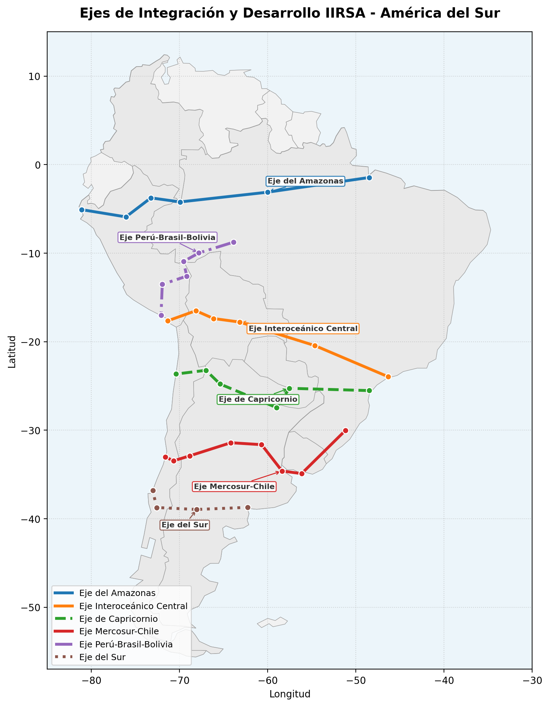
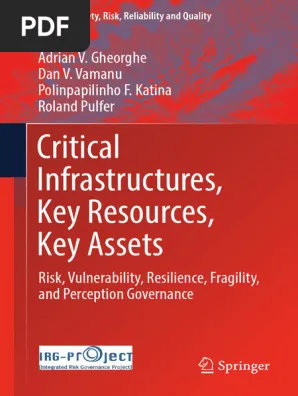

## Exploradores de los Corredores

| Alberto Rubial Handabaka | Corredores Principales |
|:----------------------------:|:----------------------------------------:|
| Exploró "en persona" físicamente todos los corredores | {width="400"} |

## Tipos de métricas

Para poder decidir sobre la conveniencia o prevalencia de un corredor
sobre otro los oferentes de carga o los importadores deben construir
indicadores *(KPI)* que los permitan decidir.

| Tipo de metríca | Fórmula | Fortaleza |
|--------------------------------|-------------------|----------------------|
| Flujo | $\frac{dx}{dt}$ | TEU / Año , facil interpretación física, mala interpretación en gestión. Es una velocidad |
| Tasa de cambio | $\frac{d^2x}{dt^2}$ | Análisis interanual (Tensión Geopolítica) es una aceleración |
| Jerk | $\frac{d^3x}{dt^3}$ | Resiliencia, tasa de cambio de la variación y la recuperación |

## Métricas de Rendimiento Logístico

Para evaluar y optimizar las cadenas logísticas modernas se requiere la
cuantificación rigurosa de cuatro pilares operativos fundamentales. No
siempre podemos medirlas en valores absolutos, pero podemos comparar
**(ratios)**

### Ratio 1 Productividad (\*\*$P$)

Puede hacerse adimensional usando como denomidador el tiempo o el
cotsto.

### Productividad impropia

Mide la eficiencia en el flujo de bienes. Su indicador clave es el costo
por tonelada-kilómetro ($CT_{tk}$) y la tasa de utilización de activos
($U_a$):
$$CT_{tk} = \frac{\text{Costo Operativo Total (USD)}}{\text{Toneladas Transportadas} \times \text{Kilómetros Recorridos}}$$

### Productividad en costo

$$U_a = \frac{\text{Tiempo de Operación Efectivo}}{\text{Tiempo Total Disponible}} \times 100$$

## Ratio 2. Ratio de Resiliencia (\*\*$R$)

Capacidad de absorber perturbaciones geopolíticas o climáticas y
recuperarse. Se mide a través del Tiempo Medio de Recuperación ($MTTR$):
$$MTTR = \frac{\sum \text{Duración de Interrupciones}}{\text{Número Total de Eventos Disruptivos}}$$

## Inversa de la resiliencia inherente

### **3. Flexibilidad (**$F$)

Capacidad de adaptación intermodal (carretera, ferroviaria, fluvial). Se
cuantifica mediante la velocidad de transferencia modal ($V_{tm}$):
$$V_{change} = \frac{\text{Volumen de Carga Transferido (TEUs)}}{\text{Tiempo de Transferencia}}$$

## Ratio 4 (tentativo) Friendshoring (\*\*$FS$)

Rarezas geopolítica. Intenta medir cosas que no habiamos medido antes

Relocalización de la cadena de suministro en países con afinidad
geopolítica. Evaluado mediante el Índice de Desviación Geopolítica
($I_{dg}$) y el costo incremental de reubicación ($\Delta C_{FS}$):
$$I_{dg} = w_1(\text{Alineación Voto ONU}) + w_2(\text{Acuerdos Comerciales}) - w_3(\text{Nivel de Riesgo})$$
$$\Delta C_{FS} = \text{Costo Operativo Nuevo} - \text{Costo Operativo Original}$$

## Infraestructura Crítica y el Freno Geopolítico

-   Infraestructura crítica vista como sistema de sistemas.
-   Su estudio tiene por finalidad estudiar el riesgo y cómo gestionarlo

## **Definición de Infraestructura Crítica**

No todos los países de la región han declarado (legislativamente) qué
entienden por infraestructura crítica.

Comprende los sistemas esenciales y activos físicos que sostienen el
funcionamiento de la economía y la sociedad regional:

\* **electricidad,**

**\*telecomunicaciones,**

**\*puertos,**

**\*caminos y ferrocarriles**.

No es sólo las distancias o las alturas a superar lo que importa. Es relevante la capacidad del territorio para generar valor agregado y compensar cargas. 

Cargas compensadas financian por el uso la inversión de la infraestructura.

## **El Impacto de las Tensiones Geopolíticas en la Inversión**

Las fricciones políticas globales y la inestabilidad institucional
frenan e inhiben de manera severa la inversión física de largo plazo en
los corredores bioceánicos sudamericanos:

-   **Elevación de la Percepción de Riesgo**: Las tensiones generan
    incertidumbre sobre las regulaciones transfronterizas y la soberanía
    de los datos, aumentando las primas de riesgo de los proyectos de
    infraestructura.

-   **Restricciones de Financiamiento**: La volatilidad macroeconómica y
    el endurecimiento de las condiciones financieras globales limitan
    tanto el presupuesto de inversión pública nacional como la atracción
    de capitales privados e internacionales (bancos multilaterales como
    la CAF, BID o FONPLATA).

-   **Falta de Continuidad de Estado**: La infraestructura transnacional
    requiere de compromisos multidecadas; no obstante, los constantes
    cambios en los ciclos políticos nacionales fragmentan las
    iniciativas, convirtiendo proyectos estratégicos en obras
    inconclusas o aisladas.

##  IA y Gobernanza Democrática en Logística

La integración de la Inteligencia Artificial en las redes de transporte
terrestre, ferroviario y marítimo redefiniría la eficiencia, pero
plantea agudos dilemas de gobernanza:

-   **Control Algorítmico y Poder (Visión de Luciano Da Empoli)**:
    Advierte sobre los riesgos de la centralización tecnológica y la
    asimetría de poder, donde los sistemas automatizados de optimización
    de rutas y flujos pueden convertirse en mecanismos de control opacos
    y hegemonía corporativa.

-   **Soberanía Digital** y Datos Democráticos (Visión de Francesca
    Bria)**: Aboga por el control público-común de los datos logísticos
    y la soberanía tecnológica. Propone que la infraestructura de datos
    e IA de los corredores logísticos sea de acceso democrático para
    evitar la dependencia tecnológica de plataformas extranjeras
    monopólicas.

-   **El Hombre en el Loop (Stefan Boss - Universidad de Hamburgo)**: Es
    imperativo estructurar los sistemas inteligentes bajo el principio
    ético de *human-in-the-loop*. La Inteligencia Artificial debe operar
    únicamente como una herramienta mediadora, asegurando que la
    decisión final y la supervisión del sistema residan siempre en los
    operadores humanos para priorizar y salvaguardar la **dignidad
    humana** por encima de la pura eficiencia del mercado.

## Estrategias de los países que impactan en los corredores

## Brasil - Neoindustrialización y Soberanía Digital

### **Políticas de Uso de IA y Desarrollo Tecnológico**

-   **Plan Nova Industria Brasil (NIB 2024–2033)**: Impulsa la
    modernización industrial a través de un fuerte sesgo hacia la
    Industria 4.0, la descarbonización y la soberanía digital.
-   **Estrategia Brasileña de Inteligencia Artificial (EBIA)**: Promueve
    proyectos tecnológicos soberanos, priorizando el desarrollo de
    modelos de lenguaje de gran escala (LLMs) adaptados al sector
    agroindustrial y a la preservación de la Amazonía.
-   **Infraestructura**: Integra el BNDES y el Ministerio de
    Planificación en iniciativas multimodales como las "Rutas de
    Integración Sudamericana".

## **Desempeño e Impacto de Brasil en el Comercio Internacional (Índice Agility 2026)**

-   **Puesto Global**: **10º lugar** con 5.48 puntos.
-   **Oportunidades Nacionales**: **8º lugar** (5.39 puntos).
-   **Oportunidades Internacionales**: **7º lugar** (5.89 puntos).
-   **Preparación Digital**: **14º lugar** (5.64 puntos).
-   **Impacto**: Brasil se consolida como el principal polo de
    manufactura avanzada y agroexportación conectada del bloque,
    buscando reducir los costos del comercio con Asia mediante los
    corredores bioceánicos.

## Diapositiva 5: México - Nearshoring Integrado

### **Políticas de Uso de IA y Desarrollo Tecnológico**

-   **Friendshoring en el T-MEC**: Integración total con la cadena de
    valor de América del Norte ("Fábrica América del Norte").
-   **Adopción por el Sector Privado**: Fuertemente impulsado por la
    Inversión Extranjera Directa (IED). La IA se está aplicando de
    manera puntual en líneas de ensamblaje automotriz, robótica
    industrial y manufactura avanzada de semiconductores.

## **Desempeño e Impacto de Mexico en el Comercio Internacional (Índice Agility 2026)**

-   **Puesto Global**: **8º lugar** con 5.78 puntos (liderando América
    Latina).
-   **Oportunidades Nacionales**: **7º lugar** (5.45 puntos).
-   **Oportunidades Internacionales**: **3º lugar** global (6.38
    puntos).
-   **Fundamentos Empresariales**: **15º lugar** (5.83 puntos).
-   **Preparación Digital**: **16º lugar** (5.40 puntos).
-   **Impacto**: Su altísima competitividad internacional le permite
    absorber la relocalización de fábricas, actuando como el nodo
    logístico por excelencia para abastecer al mercado estadounidense
    con eficiencia automatizada.

## Colombia - Transición y Reindustrialización Social

### **Políticas de Uso de IA y Desarrollo Tecnológico**

-   **Reindustrialización Social**: Articula la transformación
    tecnológica con la inclusión digital y la transición energética.
-   **Estrategia Nacional de IA**: Prioriza el desarrollo ético y
    sostenible centrado en tres sectores clave: la agroindustria, la
    protección de la biodiversidad y la optimización de recursos
    energéticos. El carbón mineral se mantiene como un recurso de peso
    durante el proceso de transición.

## **Desempeño e Impacto de Colombia en el Comercio Internacional (Índice Agility 2026)**

-   **Puesto Global**: **23º lugar** con 4.86 puntos.
-   **Oportunidades Internacionales**: **14º lugar** (5.00 puntos).
-   **Fundamentos Empresariales**: **24º lugar** (4.84 puntos).
-   **Impacto**: La adopción de IA a escala industrial enfrenta
    importantes barreras de financiamiento físico y conectividad
    terrestre. Sin embargo, su orientación de IA ética le abre
    oportunidades en mercados de exportación verdes y de comercio justo.

## Argentina - Economía del Conocimiento Desregulada

### **Políticas de Uso de IA y Desarrollo Tecnológico**

-   **Economía de Mercado y Desregulación**: La política estatal
    prioriza la desregulación, la flexibilización y la atracción de
    capitales privados en sectores tradicionales de alta productividad
    (energía, minería de litio/cobre, y agroindustria).
-   **Talento Tecnológico Privado**: Posee un ecosistema de software y
    servicios de conocimiento altamente competitivo y dinámico a nivel
    internacional, desarrollado predominantemente por el sector privado
    y sin una directriz rígida de "Estado desarrollador".

## **Desempeño e Impacto de Argentina en el Comercio Internacional (Índice Agility 2026)**

-   **Puesto Global**: **29º lugar** con 4.75 puntos.
-   **Oportunidades Nacionales**: **21º lugar** (4.87 puntos).
-   **Impacto**: Un alto potencial exportador en la economía del
    conocimiento privada. La optimización logística mediante IA privada
    busca mejorar la competitividad de las cadenas agroexportadoras y
    los yacimientos de recursos naturales, aunque la inversión en
    infraestructura vial pública y ferroviaria sigue rezagada.

## Chile - Hub Digital y Cadena de Valor Verde

### **Políticas de Uso de IA y Desarrollo Tecnológico**

-   **Hub Tecnológico de Supercomputación**: Chile se posiciona como un
    centro regional de procesamiento de datos de alta capacidad,
    respaldado por su pionera *Estrategia Nacional de IA* adaptada a los
    modelos LLM.
-   **Sostenibilidad y Minerales Críticos**: Vincula la inteligencia
    algorítmica con el desarrollo del litio y el hidrógeno verde para la
    descarbonización del transporte y la logística.

## **Desempeño e Impacto de Chile en el Comercio Internacional (Índice Agility 2026)**

-   **Puesto Global**: **13º lugar** con 5.42 puntos.
-   **Preparación Digital**: **11º lugar** (5.84 puntos) (Líder en
    América Latina).
-   **Fundamentos Empresariales**: **7º lugar** global (6.86 puntos).
-   **Oportunidades Internacionales**: **13º lugar** (5.08 puntos).
-   **Impacto**: Se consolida como la plataforma logística con mejor
    gobernanza institucional e informática de Sudamérica, facilitando la
    salida intermodal eficiente de productos mineros y agrícolas hacia
    la cuenca del Pacífico.

## Uruguay, Perú, Paraguay, Ecuador y Bolivia - Análisis Comparativo

### **Resultados del Índice Agility 2026**

-   **Uruguay**: **17º lugar** global (5.13 puntos). Destaca en
    **Fundamentos Empresariales** (8º global, 6.84) y **Preparación
    Digital** (19º, 5.35).
-   **Perú**: **26º lugar** global (4.82 puntos). Buena posición en
    **Oportunidades Internacionales** (17º, 4.86) gracias a sus puertos.
-   **Paraguay**: **33º lugar** global (4.57 puntos). **Preparación
    Digital**: 26º (4.88).
-   **Ecuador**: **34º lugar** global (4.56 puntos).
-   **Bolivia**: **49º lugar** global (3.94 puntos).

## **La Urgencia de la IA en Países Mediterráneos sin Litoral**

Para las naciones sin litoral marítimo, como **Bolivia** y **Paraguay**,
la falta de acceso directo al océano es una desventaja estructural
histórica que incrementa significativamente sus costos logísticos:

-   **Optimización Multimodal Inteligente**: Deben integrar IA para
    sincronizar la navegación fluvial, la transferencia
    puerto-ferrocarril y el transporte carretero, eliminando tiempos
    muertos aduaneros en las fronteras de tránsito.
-   **Corredores Verdes Digitales**: La gestión algorítmica de la
    hidrovía Paraguay-Paraná y el Corredor Ferroviario Bioceánico
    Central (CFBC) permite mitigar el impacto de las sequías fluviales y
    optimizar los flujos ferroviarios sin necesidad de megaobras viales
    imposibles de financiar a corto plazo.

## Diapositiva 10: Estados Unidos - Soberanía y Resiliencia Logística

### **Políticas de Uso de IA y Desarrollo Tecnológico**

-   **Soberanía Tecnológica y Seguridad Nacional**: La política
    gubernamental promueve el control riguroso de la cadena de
    suministro de semiconductores avanzados, la ciberseguridad
    industrial y el desarrollo ético de la IA.
-   **Estrategia de Relocalización**: Incentiva activamente el
    *reshoring* y el *friendshoring* para reducir la dependencia de la
    manufactura asiática, priorizando socios estratégicos dentro del
    T-MEC (México y Canadá).

## **Impacto en el Comercio Internacional**

-   EE.UU. reconfigura la arquitectura del comercio global a través de
    restricciones arancelarias y controles de exportación de tecnologías
    de IA avanzada.
-   Promueve la digitalización inteligente en sus puertos nacionales y
    terminales intermodales para garantizar un flujo ininterrumpido y
    seguro de materias primas críticas para la transición energética
    regional.

## China - "Nuevas Fuerzas Productivas de Calidad"

### **Políticas de Uso de IA y Desarrollo Tecnológico**

-   **Made in China 2025**: El marco nacional más agresivo de
    reindustrialización automatizada y digital.
-   **Nuevas Fuerzas Productivas de Calidad**: Enfocadas en lograr la
    soberanía e independencia absoluta de hardware (chips) y bases de
    datos.
-   **IA Industrial Masiva**: Integración masiva de IA y modelos LLM en
    los procesos de fabricación industrial profunda, optimización de
    megapuertos de contenedores completamente automatizados y gestión
    logística autónoma de la "Ruta de la Seda".

## **Desempeño e Impacto de China en el Comercio Internacional (Índice Agility 2026)**

-   **Puesto Global**: **1º lugar absoluto** con un puntaje de 8.44
    puntos.
-   **Impacto**: China lidera de manera hegemónica los flujos
    comerciales emergentes. Sus sistemas logísticos impulsados por IA
    predictiva a gran escala reducen drásticamente los costos de
    exportación, consolidando su posición como el mayor socio comercial
    de América del Sur y principal competidor de las manufacturas
    occidentales.

##  Corredores Logísticos para América del Sur

        DOI: 10.5281/zenodo.22113190
        
        <https://rpubs.com/ricardorpama/1454129>

### Gracias:

      **Preguntas**

          Prof. **Ricardo R. Palma** <ricardo.palma@ingenieria.uncuyo.edu.ar>
          
          * PALMA-CONTI, R.-R. (2026, August 26). 
          Corredores Logísticos de América del Sur. Zenodo. 
          * Congreso Internacional Logística Portuaria 5.0, Valparaiso - 
          * San Antonio - 
          * Los Andes. 
          https://doi.org/10.5281/zenodo.22113190
Style

